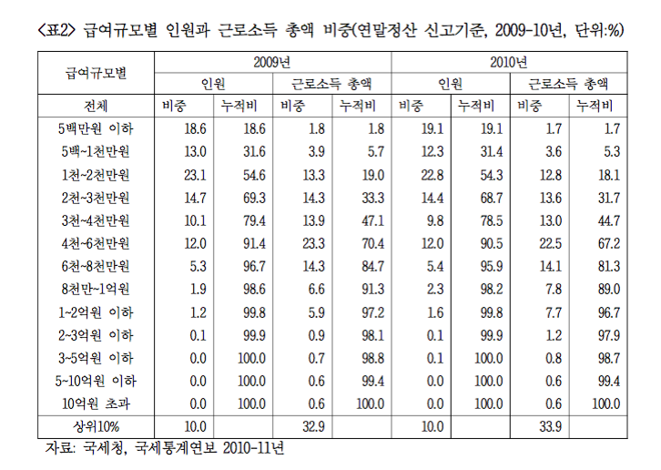

### Data Management

자료 입력



```{r, data}
library(knitr)
(income.kor <- read.table("../data/labor_income_kor.txt", header = TRUE, row.names = 1))
str(income.kor)
```

변수명을 조정하고, 다시 확인.

```{r, names}
names(income.kor) <- c("Earners(%)", "Income(%)")
kable(income.kor)
rownames(income.kor) <- sub("-", " - ", rownames(income.kor))
kable(income.kor)
```

`barplot()` 을 그리기 위하여 `height`를 설정하려면 `width`를 파악하여야 함. 그러기 위해서
소득 구간을 `rownames`의 구간으로부터 설정. `strsplit()`의 활용방법 확인, 

```{r, strsplit}
(r.names.split <- strsplit(rownames(income.kor), " - "))
```

`[]`, `[[]]`의 차이와 `[]`를 함수로 표현하는 방법에 유의(`results = 'hide'`를 지우고 실행).

```{r, extracting, results = 'hide'}
r.names.split[1]
r.names.split[1][[1]]
r.names.split[[1]]
r.names.split[[1]][1]
`[`(r.names.split, 1)
`[[`(r.names.split, 1)
```

`anonymous function`과 `sapply()`를 이용하여 긴 character list의 앞 원소만 추출하는 방법을 살필 것.

```{r, income breaks}
(r.names.split.first <- sapply(r.names.split, function(x){x[1]}))
(income.breaks <- as.numeric(r.names.split.first))
(income.breaks <- c(income.breaks, 2000))
```

`width`에 해당하는 각 소득구간의 폭을 계산

```{r, widths}
(income.widths <- diff(income.breaks))
```

각 기둥의 면적이 해당 소득구간의 퍼센티지와 같게 해주려면 각 퍼센티지를 `width`로 나눠줘야 함. 다음 각 경우를 비교(`results = 'hide'`를 지우고 실행).

```{r, height, results = 'hide'}
options(digits = 2)
(height.earners <- income.kor[, 1]/income.widths)
(height.earners.2 <- income.kor[, "Earners(%)"]/income.widths)
(height.earners.3 <- income.kor[[1]]/income.widths)
(height.earners.4 <- income.kor[1]/income.widths)
(height.earners.5 <- income.kor["Earners(%)"]/income.widths)
```

### Probability Historam via barplot

아무런 argument 도 설정하지 않고 `barplot()` 을 그리면 

```{r, barplot no args, fig.width = 12, fig.height = 4}
barplot(height.earners, width = income.widths)
```

각 막대의 이름을 `rownames`에서 가져오면

```{r, names of bar}
(names.bar <- rownames(income.kor))
```

막대의 이름을 넣어 다시 그리되, 막대 사이의 공간을 없애면
 
```{r, barplot no space,  fig.width = 12, fig.height = 4}
barplot(height.earners, width = income.widths, space = 0, names.arg = names.bar)
```

실제 인원은 거의 없는 것처럼 보이는 5억원 이상의 구간을 합쳐야 할 필요. 자료를 재구성하면,

```{r, collapse 500 or more}
income.kor.2 <- income.kor[1:11, ]
income.kor.2[11, ] <- apply(income.kor[11:13, ], 2, sum)
income.kor.2
rownames(income.kor.2)
rownames(income.kor.2)[11] <- "300 -  "
income.kor.2
(income.breaks.2 <- income.breaks[1:12])
income.widths.2 <- diff(income.breaks.2)
height.earners.2 <- income.kor.2[, 1]/income.widths.2
(names.bar.2 <- rownames(income.kor.2))
```

다시 `barplot()`을 작동시키되 회색 대신 흰색을 넣고, 막대 사이의 공간을 없애고 제목과 축이름을 붙이면

```{r, barplot white, fig.width = 12, fig.height = 4}
title.1 <- "Korea Income Wage Earners' Distribution"
xlab.1 <- "Income Class (Million Won)"
ylab.1 <- "% per Million Won"
barplot(height.earners.2, width = income.widths.2, names.arg = names.bar.2, space = 0, col = "white")
title(main = title.1, xlab = xlab.1, ylab = ylab.1)
```

1억 이상의 구간을 합치기 위하여 자료를 다시 손보면,

```{r, collapse 100 over}
income.kor.3 <- income.kor.2[1:9, ]
income.kor.3[9, ] <- apply(income.kor.2[9:11, ], 2, sum)
rownames(income.kor.3)[9] <- "100 -   "
income.breaks.3 <- income.breaks.2[-(11:12)]
income.widths.3 <- diff(income.breaks.3)
height.earners.3 <- income.kor.3[, 1]/income.widths.3
names.bar.3 <- rownames(income.kor.3)
```

1억 이상의 구간을 합쳐 barplot을 그리면,

```{r, barplot 3, fig.width = 12, fig.height = 4}
barplot(height.earners.3, width = income.widths.3, names.arg = names.bar.3, space = 0, col = "white")
title(main = title.1, xlab = xlab.1, ylab = ylab.1)
```

같은 방법으로 소득규모에 대하여 세 개의 `barplot`을 그리려면, 우선 자료를 정리하고. 

```{r, 3 sets of income data}
height.income <- income.kor[, 2]/income.widths
height.income.2 <- income.kor.2[, 2]/income.widths.2
height.income.3 <- income.kor.3[, 2]/income.widths.3
```

세 개의 barplot을 한 화면에 연속적으로 그리기 위하여 `par(mfrow = c(3, 1))` 설정

```{r, 3 income barplots, fig.width = 12, fig.height = 12}
par(mfrow = c(3, 1))
barplot(height.income, width = income.widths, names.arg = names.bar, space = 0, col = "white")
barplot(height.income.2, width = income.widths.2, names.arg = names.bar.2, space = 0, col = "white")
barplot(height.income.3, width = income.widths.3, names.arg = names.bar.3, space = 0, col = "white")
par(mfrow = c(1, 1))
```

### Cumulative distribution

`barplot` 보다 누적도표가 분포의 윤곽을 살피는 데 더 낫다는 점을 상기하면, 누적분포를 구하는 일부터 시작하여야 함. 자료로부터 이미 아는 사실이지만, `cumsum()`함수의 활용겸 확인차 계산해보면 

```{r, cumsum}
(income.kor.cum <- apply(income.kor, 2, cumsum))
```

누적도표를 그리려면 첫 좌표는 `(0, 0)`이어야 함에 유의. 마침 `income.breaks` 와 맞춰보면 `income.kor.cum`의 첫 행을 0으로만 추가해 주면 되는 일임.

```{r, add 0 at the beginning}
(income.kor.cum <- rbind(rep(0, 2), income.kor.cum))
```

누적분포의 각 계급은  `10 - 20`의 열리고 닫힌 구간이 아니라 한 쪽으로 열린 구간이어야 하고, 누적백분률임을 명시하려면   

```{r, setting intervals for cumulative distribution}
income.class.cum <- strsplit(rownames(income.kor.cum), " - ")
income.class.cum <- sapply(income.class.cum, function(x){x[2]})
(income.class.cum <- paste("0 ~", income.class.cum))
income.class.cum[c(1, 14)] <- c("~ 0", "0 ~ 2000")
rownames(income.kor.cum) <- income.class.cum
colnames(income.kor.cum) <- c("Cumulated Wage Earners (%)", "Cumulated Income (%)")
kable(income.kor.cum)
earners.kor.cum.df <- data.frame(x = income.breaks, y = income.kor.cum[, 1])
income.kor.cum.df <- data.frame(x = income.breaks, y = income.kor.cum[, 2])
```

 `xlim` 을 좁혀가면서 분포 윤곽 파악.

```{r, cumulative plots, fig.width = 12, fig.height = 12}
par(mfrow = c(2, 2))
title.2 <- "Cumulative Income Earners' Distribution"
xlab.2 <- "Income (Million Won)"
ylab.2 <- "Cumulative % of Wage Earners"
plot(earners.kor.cum.df, type = "b", ann = FALSE)
title(main = title.2, xlab = xlab.2, ylab = ylab.2)
plot(earners.kor.cum.df, type = "b", xlim = c(0, 500), ann = FALSE)
title(main = title.2, xlab = xlab.2, ylab = ylab.2)
plot(earners.kor.cum.df, type = "b", xlim = c(0, 200), ann = FALSE)
title(main = title.2, xlab = xlab.2, ylab = ylab.2)
plot(earners.kor.cum.df, type = "b", xlim = c(0, 100), ann = FALSE)
title(main = title.2, xlab = xlab.2, ylab = ylab.2)
par(mfrow = c(1, 1))
```

한가지 기억해 둘 사실은 누적분포의 윗 부분 면적이 바로 평균이라는 점. 누적분포가 히스토그램보다 나은 점 중의 하나가 분위를 찾기 쉬울 뿐 아니라 평균을 비교하는 것도 용이하다는 것임.

```{r, polygon for upper region, fig.width = 6, fig.height = 6}
plot(earners.kor.cum.df, type = "b", xlim = c(0, 200), ann = FALSE, xaxt = "n", yaxt = "n")
axis(side = 1, at = income.breaks, labels = income.breaks)
axis(side = 2, at = seq(0, 100, by = 25), labels = seq(0, 100, by = 25), las = 1)
poly.df <- rbind(earners.kor.cum.df, c(0, 100))
str(poly.df)
polygon(poly.df, density = 15, angle = 135)
# polygon(x = c(income.breaks[income.breaks <= 200], 0), y = c(income.kor.cum[, 1][income.breaks <= 200], 100), density = 15, angle = 135)
points(earners.kor.cum.df, pch = 21, col = "black", bg = "white")
lines(x = c(0, 19), y = rep(50, 2), col = "red", lwd = 2)
arrows(19, 50, x1 = 19, y1 = 0, length = 0.15, col = "red", lwd = 2)
text(x = 40, y = 25, labels = "중위소득", srt = 30, family = "AppleGothic", col = "red")
title(main = title.2, xlab = xlab.2, ylab = ylab.2)
```

소득 자체의 누적분포에 대해서도 같은 방법으로 그려보면 

```{r, income cumulative plots, fig.width = 12, fig.height = 12}
par(mfrow = c(2, 2))
title.3 <- "Cumulative Income Distribution"
ylab.3 <- "Cumulative % of Income"
plot(income.kor.cum.df, type = "b", ann = FALSE)
title(main = title.3, xlab = xlab.2, ylab = ylab.3)
plot(income.kor.cum.df, type = "b", ann = FALSE, xlim = c(0, 500))
title(main = title.3, xlab = xlab.2, ylab = ylab.3)
plot(income.kor.cum.df, type = "b", ann = FALSE, xlim = c(0, 200))
title(main = title.3, xlab = xlab.2, ylab = ylab.3)
plot(income.kor.cum.df, type = "b", ann = FALSE, xlim = c(0, 100))
abline(h = 89.1, lty = 3, col = "red")
axis(side = 2, at = 89.1, label = 89.1, las = 1)
title(main = title.3, xlab = xlab.2, ylab = ylab.3)
par(mfrow = c(1, 1))
```


이제 두 누적분포를 한 장에 살피는 방법을 생각해보자. $x$ 축을 사람, $y$ 축을 소득으로 하여 두 점을 이어주면 어떤 결과가 나오는 지 살펴 보자.

```{r, Lorenz curve, fig.width = 9, fig.height = 9}
earners <- income.kor.cum[, 1] 
income <- income.kor.cum[, 2]
earners_income.df <- data.frame(Earners = earners, Income = income)
plot(earners_income.df, type = "b", ann = FALSE, xaxt = "n", yaxt = "n")
# abline(a = 0, b = 1, xlim = c(0, 100), ylim = c(0, 100))
lines(x = c(0, 100), y = c(0, 100), type = "l")
axis(side = 1, at = earners, labels = earners)
axis(side = 2, at = income, labels = income)
abline(h = c(0, 100), lty = 3)
abline(v = c(0, 100), lty = 3)
title.4 <- "Lorenz Curve of Korea Wage Earners' Income"
xlab.4 <- "Wage Earners Cumulated (%)"
ylab.4 <- "Income Cumulated (%)"
title(main = title.4, xlab = xlab.4, ylab = ylab.4)
```

초승달 부분에 빗금을 치고, 각 축의 눈금을 가능한 많이 표시하려면 `polygon()`과 `axis(..., las = )`을 이용하게 되는 데 이 때 다각형을 구성하는데 필요한 좌표들은 이미 `earners_income.df`에 모두 나와 있음에 유의하여야 함.

```{r, shading, fig.width = 9, fig.height = 9}
plot(earners_income.df, type = "b", ann = FALSE, xaxt = "n", yaxt = "n")
# abline(a = 0, b = 1, xlim = c(0, 100), ylim = c(0, 100))
lines(x = c(0, 100), y = c(0, 100), type = "l")
axis(side = 1, at = earners, labels = earners)
axis(side = 2, at = income[c(1:10, 14)], labels = income[c(1:10, 14)], las = 1)
abline(h = c(0, 100), lty = 3)
abline(v = c(0, 100), lty = 3)
title(main = title.4, xlab = xlab.4, ylab = ylab.4)
polygon(earners_income.df, density = 10, angle = 135)
points(earners_income.df, pch = 21, col = "black", bg = "white")
```

이 곡선의 이름은 무엇인가요? [Lorenz Curve](https://en.wikipedia.org/wiki/Lorenz_curve) 참조.

### Gini coefficient 

지니계수는 완전평등선과 로렌츠 곡선 사이의 면적을 완전불평등 상황에서의 면적, 즉 1/2로 나눠 준 값이다. 이 값이 클수록 불평등이 심한 것으로 간주할 수 있다. 이 초승달 모양 면적은 삼각형 면적에서 로렌츠 곡선 아래 면적을 뺀 것과 같아지므로 이전에 작성한 `arae.R`함수를 이용할 수 있다.

```{r, gini coefficient}
options(digits = 3)
source("area.R")
gini <- 2*(1/2 - area.R(x = earners, y = income)/10000)
```

계산된 지니계수를 그림 안에 텍스트로 넣어주려면 `paste()`를 이용하여 입력토록한다.

```{r, gini added, fig.width = 9, fig.height = 9}
plot(earners_income.df, type = "b", ann = FALSE, xaxt = "n", yaxt = "n")
# abline(a = 0, b = 1, xlim = c(0, 100), ylim = c(0, 100))
lines(x = c(0, 100), y = c(0, 100), type = "l")
axis(side = 1, at = earners, labels = earners)
axis(side = 2, at = income[c(1:10, 14)], labels = income[c(1:10, 14)], las = 1)
abline(h = c(0, 100), lty = 3)
abline(v = c(0, 100), lty = 3)
title(main = title.4, xlab = xlab.4, ylab = ylab.4)
polygon(earners_income.df, density = 10, angle = 135)
points(earners_income.df, pch = 21, col = "black", bg = "white")
text(x = 30, y = 60, labels = paste("Gini = ", round(gini, digits = 3)), cex = 1.5)
```

### ggplot

단계별로 결과물을 저장하면서 작업할 수 있도록 구성하였으니 `fig.keep = 'none'` 를 `fig.keep = 'all'`로 바꿔서 실행시켜보면 각 단계에서 어떤 점이 추가되는 지 살필 수 있다.

```{r, ggplot, fig.width = 9, fig.height = 9, fig.keep = 'none'}
library(ggplot2)
(g1 <- ggplot() +
  geom_line(data = earners_income.df, aes(x = earners, y = income))) 
(g2 <- g1 +
  geom_line(data = data.frame(x = c(0, 100), y = c(0, 100)), aes(x = x, y = y))) 
(g3 <- g2 +
  geom_hline(yintercept = c(0, 100), linetype = "dotted")) 
(g4 <- g3 +
  geom_vline(xintercept = c(0, 100), linetype = "dotted")) 
(g5 <- g4 + 
  geom_polygon(data = earners_income.df, aes(x = earners, y = income), alpha = 0.5, fill = "grey")) 
(g6 <- g5 +
  geom_point(data = earners_income.df, aes(x = earners, y = income), shape = 21, fill = "white", size = 3)) 
(g7 <- g6 +
  ggtitle(title.4) + xlab(xlab.4) + ylab(ylab.4)) 
(g8 <- g7 +
  scale_x_continuous(breaks = earners[c(1:8, 14)], labels = earners[c(1:8, 14)])) 
(g9 <- g8 +
  scale_y_continuous(breaks = seq(0, 100, by = 25))) 
(g10 <- g9 +
  annotate("text", x = 30, y = 60, label = paste("Gini = ", round(gini, digits = 3)), size = 7)) 
(g11 <- g10 +
  theme_bw())
```

```{r, final output, fig.width = 9, fig.height = 9}
g11
```
